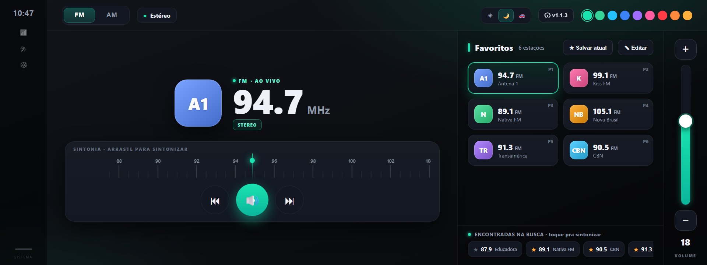

# 📻 Haval Radio

Interface de **rádio FM/AM customizada** para a central multimídia de veículos **Haval/GWM**, como app Android **standalone** — UI própria em Jetpack Compose, dirigindo o tuner nativo do carro.



> ⚠️ Projeto pessoal, educacional e **não oficial**, sem vínculo com Haval/GWM. Envolve engenharia reversa da central para fins de estudo. Uso por sua conta e risco.

## ✨ O que faz

- 📻 **FM e AM** — sintonia e troca de banda
- 🎚️ **Régua de sintonia** — arraste para sintonizar; botões de estação anterior/próxima
- ⭐ **Favoritos** — lista própria, gerenciada pela estrela; toque para sintonizar
- 🔊 **Volume vertical** + **Mudo** (o liga/desliga do som)
- ▶️ **Auto-play ao abrir** — se o rádio não estiver tocando, já sintoniza uma favorita (com som)
- 🌗 **Tema** — Claro / Escuro / **Sistema** (segue o dia/noite do carro)
- 🎨 **Cor de acento** — 9 paletas selecionáveis na barra de cores da topbar
- 🚗 **Auto start** — abre o app ao ligar o carro (com toggle no "Sobre")
- ⬆️ **Auto-atualização** — verifica e instala novas versões pelo próprio app

## 🧩 Como funciona

Stack: **Kotlin · Jetpack Compose · Material 3 · Shizuku**. minSdk/targetSdk 28 (Android 9), compileSdk 36.

O app fala com o `IntelligentVehicleControlService` (SDK Beantechs) via **Shizuku**, dirigindo as
propriedades `sys.radio.*` do tuner:

```
ServiceManager.getService("com.beantechs.intelligentvehiclecontrol")   # reflexão + HiddenApiBypass
  → ShizukuBinderWrapper
  → fetchData(key)                                  # leitura
  → request("cmd.common.request.set", key, value)   # escrita
```

Sintonia, banda, volume e estado saem direto das `sys.radio.*` / `media_volume`. Mas dois pontos
exigiram engenharia reversa:

- 🔑 **Tocar com som (foco de áudio):** escrever `sys.radio.play_state` é **rejeitado** para apps de
  terceiros, e só sintonizar não traz som — o foco de áudio pertence ao `com.beantechs.mediacenter`.
  A solução é **replicar a tecla "próxima favorita" do volante**: um broadcast
  `BEAN_GLOBAL_KEY_EVENT` (keyCode `517`) que faz o mediacenter reconquistar o foco e tocar.
- ⭐ **Favoritos locais:** o veículo nunca expõe os favoritos do rádio em runtime, então o app
  mantém a própria lista (`SharedPreferences`).

## ⛔ Limitações (honestas)

O que a central **não permite** a um app de terceiro — comprovado por recon ao vivo:

| Recurso | Status |
|---|---|
| Pausar o tuner | ❌ `play_state` é read-only; o foco de áudio é do mediacenter. O **Mudo** faz as vezes. |
| Busca / scan de estações | ❌ `search_state` é read-only e não há gatilho externo. (Botão de busca oculto por ora.) |
| RDS (nome da estação / radiotext) | ❌ A central não fornece — PS e radiotext vêm vazios (nem o app stock mostra nome). |
| Sinal / HD Radio | ❌ Existe só no HAL do tuner, não exposto pelo bridge `sys.radio.*`. |

## 🖼️ Protótipo

A UI é desenhada num mockup HTML versionado em [`prototype/index-v2.html`](prototype/index-v2.html)
(a imagem acima é ele):

```bash
node prototype/serve.js   # http://localhost:4599
```

## 🚀 Build & instalação

Releases saem por **tag** via GitHub Actions, gerando um **APK assinado** anexado à release. No
carro, o app **se auto-atualiza** (lê o feed de releases do GitHub e instala).

```bash
# sideload inicial (uma vez), com a central acessível por ADB:
adb install -r app-release.apk

# build local (precisa de JDK + Android SDK):
./gradlew :app:assembleRelease
```

**Pré-requisito no carro:** **Shizuku** ativo e permissão concedida ao app (o app não faz o
bootstrap do Shizuku).

## 🗂️ Estrutura

```
app/src/main/java/.../havalradio/
├─ MainActivity.kt            # entrada: tema + Shizuku + RadioScreen
├─ App.kt                     # init dos stores
├─ BootReceiver.kt            # auto start (abrir ao ligar o carro)
├─ data/
│  ├─ RadioRepository.kt      # estado observável + ações (tune/seek/banda/volume/auto-play)
│  ├─ RadioKeys.kt            # chaves sys.radio.*
│  ├─ RadioModels.kt          # Station/Band + codec {freq,banda,play,stereo}
│  ├─ VehicleClient.kt        # bind do serviço via Shizuku + reflexão
│  ├─ MediaCenterControl.kt   # broadcast 517 → tocar via foco de áudio
│  ├─ FavoritesStore.kt       # favoritos locais
│  └─ ThemeStore / AccentStore / SettingsStore
├─ ui/                        # RadioScreen, NowPlaying, FavoritesPanel, VolumeColumn,
│                             # Controls, TuningRuler, AboutDialog, theme/
└─ update/UpdateManager.kt    # auto-atualização (releases.atom + APK)
```

## 📄 Licença

MIT — ver [LICENSE](LICENSE).
